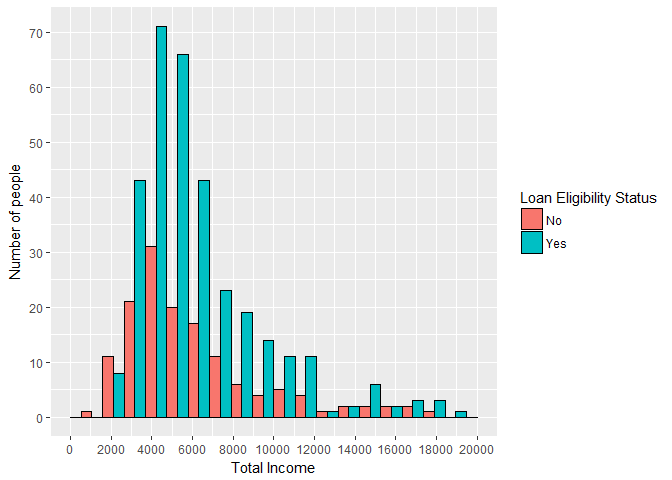

Loan Prediction
================
**Nihit R. Save** <br />
13th February 2017

Dataset: <https://datahack.analyticsvidhya.com/contest/practice-problem-loan-prediction-iii/>

Data Exploration
================

Loading Dataset from work directory.

``` r
train <- read.csv("train.csv",na.strings = c("","NA"))
test <- read.csv("test.csv",na.strings = c("","NA"))
```

Exploring data and data types in train dataset.

``` r
str(train)
```

    ## 'data.frame':    614 obs. of  13 variables:
    ##  $ Loan_ID          : Factor w/ 614 levels "LP001002","LP001003",..: 1 2 3 4 5 6 7 8 9 10 ...
    ##  $ Gender           : Factor w/ 2 levels "Female","Male": 2 2 2 2 2 2 2 2 2 2 ...
    ##  $ Married          : Factor w/ 2 levels "No","Yes": 1 2 2 2 1 2 2 2 2 2 ...
    ##  $ Dependents       : Factor w/ 4 levels "0","1","2","3+": 1 2 1 1 1 3 1 4 3 2 ...
    ##  $ Education        : Factor w/ 2 levels "Graduate","Not Graduate": 1 1 1 2 1 1 2 1 1 1 ...
    ##  $ Self_Employed    : Factor w/ 2 levels "No","Yes": 1 1 2 1 1 2 1 1 1 1 ...
    ##  $ ApplicantIncome  : int  5849 4583 3000 2583 6000 5417 2333 3036 4006 12841 ...
    ##  $ CoapplicantIncome: num  0 1508 0 2358 0 ...
    ##  $ LoanAmount       : int  NA 128 66 120 141 267 95 158 168 349 ...
    ##  $ Loan_Amount_Term : int  360 360 360 360 360 360 360 360 360 360 ...
    ##  $ Credit_History   : int  1 1 1 1 1 1 1 0 1 1 ...
    ##  $ Property_Area    : Factor w/ 3 levels "Rural","Semiurban",..: 3 1 3 3 3 3 3 2 3 2 ...
    ##  $ Loan_Status      : Factor w/ 2 levels "N","Y": 2 1 2 2 2 2 2 1 2 1 ...

Checking for missing values

``` r
table(is.na(train))
```

    ## 
    ## FALSE  TRUE 
    ##  7833   149

There are 149 missing values in the train data set. <br /> Lets see which variables have missing values.

``` r
colSums(is.na(train))
```

    ##           Loan_ID            Gender           Married        Dependents 
    ##                 0                13                 3                15 
    ##         Education     Self_Employed   ApplicantIncome CoapplicantIncome 
    ##                 0                32                 0                 0 
    ##        LoanAmount  Loan_Amount_Term    Credit_History     Property_Area 
    ##                22                14                50                 0 
    ##       Loan_Status 
    ##                 0

Missing values in categorical variables like Gender and Married cannot be predicted accurately and would require treatment in later stages.

Observing the distribution of variables in dataset.

``` r
summary(train)
```

    ##      Loan_ID       Gender    Married    Dependents        Education  
    ##  LP001002:  1   Female:112   No  :213   0   :345   Graduate    :480  
    ##  LP001003:  1   Male  :489   Yes :398   1   :102   Not Graduate:134  
    ##  LP001005:  1   NA's  : 13   NA's:  3   2   :101                     
    ##  LP001006:  1                           3+  : 51                     
    ##  LP001008:  1                           NA's: 15                     
    ##  LP001011:  1                                                        
    ##  (Other) :608                                                        
    ##  Self_Employed ApplicantIncome CoapplicantIncome   LoanAmount   
    ##  No  :500      Min.   :  150   Min.   :    0     Min.   :  9.0  
    ##  Yes : 82      1st Qu.: 2878   1st Qu.:    0     1st Qu.:100.0  
    ##  NA's: 32      Median : 3812   Median : 1188     Median :128.0  
    ##                Mean   : 5403   Mean   : 1621     Mean   :146.4  
    ##                3rd Qu.: 5795   3rd Qu.: 2297     3rd Qu.:168.0  
    ##                Max.   :81000   Max.   :41667     Max.   :700.0  
    ##                                                  NA's   :22     
    ##  Loan_Amount_Term Credit_History     Property_Area Loan_Status
    ##  Min.   : 12      Min.   :0.0000   Rural    :179   N:192      
    ##  1st Qu.:360      1st Qu.:1.0000   Semiurban:233   Y:422      
    ##  Median :360      Median :1.0000   Urban    :202              
    ##  Mean   :342      Mean   :0.8422                              
    ##  3rd Qu.:360      3rd Qu.:1.0000                              
    ##  Max.   :480      Max.   :1.0000                              
    ##  NA's   :14       NA's   :50

Important Observations: Presence of Outlier in Applicant Income field with maximum value being 81000 and 3rd quantile is only 5795. <br /> Similarly there are outliers present in Coapplicant Income.Maximum value is 41667 while 3rd quantile is 2297.

We notice that Credit History has only 2 levels. Therefore we shall set it as factor.

``` r
train$Credit_History <- factor(train$Credit_History)
```

Data Exploration using Graphs
=============================

Total Income and Loan Status

``` r
  library(ggplot2)


ggplot(na.omit(train),aes(x = ApplicantIncome + CoapplicantIncome)) + geom_histogram(col = "black",position = "dodge",bins = 20,aes(fill = Loan_Status))+scale_x_continuous(breaks = seq(0,20000,2000),limits = c(0,20000)) + scale_y_continuous(breaks = seq(0,90,10)) +xlab("Total Income") + ylab("Number of people") + scale_fill_discrete(name="Loan Acceptance Status",labels = c("No","Yes"))
```



Conclusion: The proportion of people whose loan is accepted increases with the total salary.Thus we can say that total income of applicants play important role in whether the loan is accepted or not.

Total Income,credit history and Status

``` r
ggplot(na.omit(train) , aes(x = ApplicantIncome + CoapplicantIncome,y = Credit_History,col = Loan_Status )) + geom_jitter() + scale_x_continuous(limits = c(0,20000)) + scale_color_discrete(name="Loan Status",labels = c("No","Yes")) + xlab("Total Income") + ylab("Credit History") + ggtitle("Loan Status by Credit History and Income") + scale_y_discrete(labels = c("Not valid","Valid")) + theme(legend.position = "bottom")
```


Conclusion: Thus we can clearly see that the people who do not have valid credit history have very low chance of their loan being accepted inspite of their total income.

Property Area

``` r
ggplot(na.omit(train),aes(x = LoanAmount,fill = Loan_Status)) + geom_bar(stat = "count",binwidth = 25,position = "dodge",col = "black") + facet_wrap(~Property_Area) + scale_x_continuous(limits = c(0,600),breaks = seq(0,600,50)) + scale_y_continuous(breaks = seq(0,50,5)) + ylab("Number of people") + xlab("Loan Amount") + scale_fill_discrete(name="Loan Acceptance Status",labels = c("No","Yes")) + ggtitle("Loan Acceptance Status by Type of Property Area and Loan Amount ")
```


Conclusion: The proportion of people who get their loan accepted for semiurban or urban property is far more than for rural property for the respective loan amount.It could be due to the fact that rural property cost less than semiurban or urban property and less loan is expected to be taken by customers.

Imputation of missing values
============================

To impute missing values we shall use MICE packages. <br /> MICE stands for Multiple Imputation using Chained Equations. <br /> This method tries to predict the values of missing fields based on other variables.

``` r
library(mice)
```

    ## Loading required package: Rcpp

    ## mice 2.25 2015-11-09

``` r
md.pattern(train)
```

    ##     Loan_ID Education ApplicantIncome CoapplicantIncome Property_Area
    ## 480       1         1               1                 1             1
    ##  12       1         1               1                 1             1
    ##  10       1         1               1                 1             1
    ##  25       1         1               1                 1             1
    ##  19       1         1               1                 1             1
    ##  12       1         1               1                 1             1
    ##  43       1         1               1                 1             1
    ##   2       1         1               1                 1             1
    ##   1       1         1               1                 1             1
    ##   1       1         1               1                 1             1
    ##   1       1         1               1                 1             1
    ##   1       1         1               1                 1             1
    ##   5       1         1               1                 1             1
    ##   1       1         1               1                 1             1
    ##   1       1         1               1                 1             1
    ##           0         0               0                 0             0
    ##     Loan_Status Married Gender Loan_Amount_Term Dependents LoanAmount
    ## 480           1       1      1                1          1          1
    ##  12           1       1      0                1          1          1
    ##  10           1       1      1                1          0          1
    ##  25           1       1      1                1          1          1
    ##  19           1       1      1                1          1          0
    ##  12           1       1      1                0          1          1
    ##  43           1       1      1                1          1          1
    ##   2           1       0      1                1          0          1
    ##   1           1       1      1                1          0          0
    ##   1           1       1      1                0          0          1
    ##   1           1       1      1                0          1          1
    ##   1           1       1      0                1          1          1
    ##   5           1       1      1                1          1          1
    ##   1           1       0      1                1          0          0
    ##   1           1       1      1                1          1          0
    ##               0       3     13               14         15         22
    ##     Self_Employed Credit_History    
    ## 480             1              1   0
    ##  12             1              1   1
    ##  10             1              1   1
    ##  25             0              1   1
    ##  19             1              1   1
    ##  12             1              1   1
    ##  43             1              0   1
    ##   2             1              1   2
    ##   1             1              1   2
    ##   1             1              1   2
    ##   1             0              1   2
    ##   1             1              0   2
    ##   5             0              0   2
    ##   1             1              1   3
    ##   1             0              0   3
    ##                32             50 149

The pattern of missing values can be seen from this table. <br /> For example the 8th row tells us that there are 2 rows in training set that have NAs in both Married and Dependents.

``` r
  MiceImpTrain <- mice(train,m = 3,maxit = 5,MaxNWts = 3000,seed = 123)
```

    iter imp variable
      1   1  Gender  Married  Dependents  Self_Employed  LoanAmount  Loan_Amount_Term  Credit_History
      1   2  Gender  Married  Dependents  Self_Employed  LoanAmount  Loan_Amount_Term  Credit_History
      1   3  Gender  Married  Dependents  Self_Employed  LoanAmount  Loan_Amount_Term  Credit_History
      2   1  Gender  Married  Dependents  Self_Employed  LoanAmount  Loan_Amount_Term  Credit_History
      2   2  Gender  Married  Dependents  Self_Employed  LoanAmount  Loan_Amount_Term  Credit_History
      2   3  Gender  Married  Dependents  Self_Employed  LoanAmount  Loan_Amount_Term  Credit_History
      3   1  Gender  Married  Dependents  Self_Employed  LoanAmount  Loan_Amount_Term  Credit_History
      3   2  Gender  Married  Dependents  Self_Employed  LoanAmount  Loan_Amount_Term  Credit_History
      3   3  Gender  Married  Dependents  Self_Employed  LoanAmount  Loan_Amount_Term  Credit_History
      4   1  Gender  Married  Dependents  Self_Employed  LoanAmount  Loan_Amount_Term  Credit_History
      4   2  Gender  Married  Dependents  Self_Employed  LoanAmount  Loan_Amount_Term  Credit_History
      4   3  Gender  Married  Dependents  Self_Employed  LoanAmount  Loan_Amount_Term  Credit_History
      5   1  Gender  Married  Dependents  Self_Employed  LoanAmount  Loan_Amount_Term  Credit_History
      5   2  Gender  Married  Dependents  Self_Employed  LoanAmount  Loan_Amount_Term  Credit_History
      5   3  Gender  Married  Dependents  Self_Employed  LoanAmount  Loan_Amount_Term  Credit_History

We have set number of multiple of imputations to 3 which is the number of complete datasets created by MICE. <br /> Number of iterations is set to 5 which is the number of times the NAs are evaluated per dataset.

``` r
MiceImpTrain$method
```

              Loan_ID            Gender           Married        Dependents         Education     Self_Employed 
                   ""          "logreg"          "logreg"         "polyreg"                ""          "logreg" 
      ApplicantIncome CoapplicantIncome        LoanAmount  Loan_Amount_Term    Credit_History     Property_Area 
                   ""                ""             "pmm"             "pmm"          "logreg"                "" 
          Loan_Status 
                   "" 

This table tells us the methods used to predict missing values in respective field. <br /> For Gender,Married,Self Employed and Credit History Logistic Regression is used because they have 2 levels each. <br /> For Dependents since there are multiple levels polytomous logistic regression is used. <br /> On the other hand,since Loan Amount and Loan Term are continuous variables predictive mean matching is used.

``` r
MiceImpTrain$imp
```

    $Loan_ID
    NULL

    $Gender
             1      2      3
    24    Male   Male   Male
    127   Male Female   Male
    172 Female   Male   Male
    189   Male Female   Male
    315   Male   Male   Male
    335   Male Female   Male
    461   Male Female   Male
    468   Male   Male   Male
    478   Male   Male   Male
    508 Female   Male   Male
    577   Male   Male   Male
    589   Male Female Female
    593   Male Female Female

    $Married
      1   2  3
    105  No  No No
    229 Yes Yes No
    436 Yes Yes No

    $Dependents
         1  2 3
    103  0  0 1
    105  0  0 0
    121 3+  1 1
    227  0  1 1
    229  2  1 0
    294  0  0 0
    302 3+  1 2
    333  0  0 0
    336 3+  1 0
    347 3+  1 1
    356  0  0 0
    436  1 3+ 0
    518  2  1 1
    572  1  0 1
    598  2  0 0

    $Education
    NULL

    $Self_Employed
          1   2   3
    12   No  No Yes
    20   No  No Yes
    25   No Yes Yes
    30   No Yes Yes
    31  Yes Yes Yes
    96  Yes  No  No
    108  No  No Yes
    112 Yes Yes Yes
    115  No  No Yes
    159  No  No Yes
    171  No  No Yes
    219  No Yes Yes
    232 Yes  No Yes
    237 Yes Yes Yes
    269 Yes Yes Yes
    296  No  No Yes
    334 Yes Yes Yes
    337  No  No Yes
    345  No Yes Yes
    375 Yes Yes Yes
    381 Yes  No Yes
    386 Yes  No  No
    412 Yes  No Yes
    433  No Yes Yes
    448  No  No Yes
    464  No Yes Yes
    469  No Yes Yes
    536  No  No Yes
    543 Yes Yes Yes
    580 Yes  No Yes
    601 Yes Yes Yes
    602  No  No Yes

    $ApplicantIncome
    NULL

    $CoapplicantIncome
    NULL

    $LoanAmount
          1   2   3
    1   106  46  88
    36  148  66 113
    64   90 128 102
    82  121  66 148
    96   76 105  88
    103 137  66 128
    104 137  66 134
    114  61  26 121
    128  99  45  88
    203 168 170  98
    285 122 128 114
    306 108 105  87
    323 130 115 132
    339  81 139  60
    388 122 128  88
    436  93  86  98
    438 143  66 113
    480 144 175 132
    525 100 105 108
    551  90 175 107
    552 133  66 128
    606 155 109  99

    $Loan_Amount_Term
          1   2   3
    20  360 360 360
    37  300 360 240
    45  360 360 360
    46  360 300 300
    74   60 480 300
    113 240 360 240
    166 360 480 360
    198 360 300 300
    224 360 480 360
    233 360 360 360
    336 180 360 360
    368 180 360 240
    422 240 240 120
    424 240 360 240

    $Credit_History
        1 2 3
    17  1 1 1
    25  0 1 1
    31  0 1 0
    43  1 1 1
    80  1 1 1
    84  0 0 0
    87  1 1 1
    96  1 0 0
    118 1 1 1
    126 1 1 1
    130 0 0 0
    131 1 0 0
    157 1 1 1
    182 0 0 1
    188 1 1 1
    199 0 0 1
    220 0 0 1
    237 0 0 0
    238 0 1 0
    260 0 0 0
    261 0 1 1
    280 0 1 1
    310 1 1 1
    314 1 1 1
    318 1 1 1
    319 0 1 1
    324 0 0 1
    349 1 0 0
    364 1 1 0
    378 1 1 1
    393 0 1 1
    396 1 1 1
    412 1 1 0
    445 0 1 0
    450 1 1 0
    452 1 1 1
    461 1 1 0
    474 0 1 1
    491 1 1 1
    492 0 1 1
    498 1 1 1
    504 0 1 1
    507 0 0 0
    531 0 1 0
    534 1 1 1
    545 0 1 1
    557 0 1 1
    566 1 1 0
    584 0 1 1
    601 0 0 0

    $Property_Area
    NULL

    $Loan_Status
    NULL

We shall fill the dataset using complete function.

``` r
MicedTrain <- complete(MiceImpTrain,action = 3)
```

Similarly we shall fill in the missing values in test data set using MICE.

``` r
MiceImpTest <- mice(data = test, m = 3, maxit = 5, seed = 123, MaxNWts = 3000)
```

    iter imp variable
      1   1  Gender  Dependents  Self_Employed  LoanAmount  Loan_Amount_Term  Credit_History
      1   2  Gender  Dependents  Self_Employed  LoanAmount  Loan_Amount_Term  Credit_History
      1   3  Gender  Dependents  Self_Employed  LoanAmount  Loan_Amount_Term  Credit_History
      2   1  Gender  Dependents  Self_Employed  LoanAmount  Loan_Amount_Term  Credit_History
      2   2  Gender  Dependents  Self_Employed  LoanAmount  Loan_Amount_Term  Credit_History
      2   3  Gender  Dependents  Self_Employed  LoanAmount  Loan_Amount_Term  Credit_History
      3   1  Gender  Dependents  Self_Employed  LoanAmount  Loan_Amount_Term  Credit_History
      3   2  Gender  Dependents  Self_Employed  LoanAmount  Loan_Amount_Term  Credit_History
      3   3  Gender  Dependents  Self_Employed  LoanAmount  Loan_Amount_Term  Credit_History
      4   1  Gender  Dependents  Self_Employed  LoanAmount  Loan_Amount_Term  Credit_History
      4   2  Gender  Dependents  Self_Employed  LoanAmount  Loan_Amount_Term  Credit_History
      4   3  Gender  Dependents  Self_Employed  LoanAmount  Loan_Amount_Term  Credit_History
      5   1  Gender  Dependents  Self_Employed  LoanAmount  Loan_Amount_Term  Credit_History
      5   2  Gender  Dependents  Self_Employed  LoanAmount  Loan_Amount_Term  Credit_History
      5   3  Gender  Dependents  Self_Employed  LoanAmount  Loan_Amount_Term  Credit_History

``` r
MicedTest <- complete(MiceImpTest,action = 1)
```

### Combining Datasets

``` r
dim(train)
```

    ## [1] 614  13

``` r
dim(test)
```

    ## [1] 367  12

Test dataset has 1 less column which is that of value to predicted. <br /> Adding Loan Status column in test dataset.

``` r
MicedTest$Loan_Status <- NA
```

Combining both the datasets for further data manipulation.

``` r
combined <- rbind(MicedTrain,MicedTest)
```

### Feature Engineering New Variables: Ratio and Loan Term Year

Individuals who have more income might be able to take more loan. <br /> Therefore we shall create a new variable called Ratio and set it equal to Total Income divided by Loan Amount.

``` r
combined$Total_Income <- combined$ApplicantIncome + combined$CoapplicantIncome
combined$Ratio <- combined$Total_Income/combined$LoanAmount
```

``` r
table(combined$Loan_Amount_Term)
```

    ## 
    ##  12  36  60  84 120 180 240 300 360 480 
    ##   3   3   3   7   5  66  14  23 834  23

We notice that Loan Term takes only few distinct values which are the number of months. <br /> Hence we shall represent it in number of years and set it as factor.

``` r
combined$Loan_Term_Year <- as.factor(combined$Loan_Amount_Term/12)
```

Lets explore how loan amount and loan term are related. Loan Amount and Term

``` r
 ggplot(na.omit(combined),aes(x = Loan_Term_Year,y= LoanAmount,col = Loan_Status)) + geom_jitter() + scale_color_discrete(name = "Loan Status") + facet_wrap(~Loan_Status) + xlab("Loan Term in Years") + ylab("Loan Amount")
```

 Conclusion: Most of the people have taken loan for 30 years. <br /> Loan term is not a major deciding factor in deciding loan status.

### Outlier Treatment

Earlier we noticed that there were some outliers in our dataset. <br /> We shall normalize the distribution of Total Income and Loan Amount by using logarithmic function and store it as new variable.

``` r
combined$Total_Income_Log <- log(combined$Total_Income)
```

``` r
combined$Loan_Amount_Log <- log(combined$LoanAmount)
```

### Splitting the dataset

``` r
new_train <- combined[(1:nrow(train)),]
new_test <- combined[-(1:nrow(train)),]
```

Using Logistic Regression Model
===============================

Initially we create a base model without adding any new variables as a basis for evaluating our further models.

``` r
 BaseModel <- glm(Loan_Status ~ Gender + Married + Dependents + Education + Self_Employed + ApplicantIncome + CoapplicantIncome + LoanAmount + Loan_Term_Year + Credit_History + Property_Area,data = new_train, family = "binomial")

summary(BaseModel)
```

    ## 
    ## Call:
    ## glm(formula = Loan_Status ~ Gender + Married + Dependents + Education + 
    ##     Self_Employed + ApplicantIncome + CoapplicantIncome + LoanAmount + 
    ##     Loan_Term_Year + Credit_History + Property_Area, family = "binomial", 
    ##     data = new_train)
    ## 
    ## Deviance Residuals: 
    ##     Min       1Q   Median       3Q      Max  
    ## -2.2383  -0.5134   0.5319   0.6983   2.4703  
    ## 
    ## Coefficients:
    ##                          Estimate Std. Error z value Pr(>|z|)    
    ## (Intercept)             1.164e+01  1.455e+03   0.008  0.99362    
    ## GenderMale             -9.796e-04  2.989e-01  -0.003  0.99738    
    ## MarriedYes              5.679e-01  2.606e-01   2.179  0.02932 *  
    ## Dependents1            -5.854e-01  2.959e-01  -1.979  0.04783 *  
    ## Dependents2             9.065e-03  3.316e-01   0.027  0.97819    
    ## Dependents3+           -2.207e-01  4.151e-01  -0.532  0.59494    
    ## EducationNot Graduate  -3.800e-01  2.587e-01  -1.469  0.14182    
    ## Self_EmployedYes        1.268e-01  2.831e-01   0.448  0.65425    
    ## ApplicantIncome        -7.409e-06  2.455e-05  -0.302  0.76279    
    ## CoapplicantIncome      -4.976e-05  4.052e-05  -1.228  0.21946    
    ## LoanAmount              3.322e-04  1.711e-03   0.194  0.84605    
    ## Loan_Term_Year3        -3.089e+01  1.782e+03  -0.017  0.98617    
    ## Loan_Term_Year5         5.213e-01  1.780e+03   0.000  0.99977    
    ## Loan_Term_Year7        -1.426e+01  1.455e+03  -0.010  0.99218    
    ## Loan_Term_Year10       -1.305e+01  1.455e+03  -0.009  0.99284    
    ## Loan_Term_Year15       -1.368e+01  1.455e+03  -0.009  0.99250    
    ## Loan_Term_Year20       -1.452e+01  1.455e+03  -0.010  0.99204    
    ## Loan_Term_Year25       -1.351e+01  1.455e+03  -0.009  0.99260    
    ## Loan_Term_Year30       -1.393e+01  1.455e+03  -0.010  0.99236    
    ## Loan_Term_Year40       -1.516e+01  1.455e+03  -0.010  0.99169    
    ## Credit_History          3.171e+00  3.054e-01  10.383  < 2e-16 ***
    ## Property_AreaSemiurban  9.807e-01  2.685e-01   3.652  0.00026 ***
    ## Property_AreaUrban      3.298e-01  2.633e-01   1.253  0.21039    
    ## ---
    ## Signif. codes:  0 '***' 0.001 '**' 0.01 '*' 0.05 '.' 0.1 ' ' 1
    ## 
    ## (Dispersion parameter for binomial family taken to be 1)
    ## 
    ##     Null deviance: 762.89  on 613  degrees of freedom
    ## Residual deviance: 562.96  on 591  degrees of freedom
    ## AIC: 608.96
    ## 
    ## Number of Fisher Scoring iterations: 14

From above summary we can see that Number of Dependants,Married,Credit History and Property Area are major deciding factors to predict loan status. <br /> We will use AIC to judge if our next models perform better than our base model.

``` r
Model2 <- glm(Loan_Status ~ Gender + Married + Dependents + Education + Self_Employed + Ratio + Loan_Term_Year + Credit_History + Property_Area,data = new_train, family = "binomial")


summary(Model2)
```

    ## 
    ## Call:
    ## glm(formula = Loan_Status ~ Gender + Married + Dependents + Education + 
    ##     Self_Employed + Ratio + Loan_Term_Year + Credit_History + 
    ##     Property_Area, family = "binomial", data = new_train)
    ## 
    ## Deviance Residuals: 
    ##     Min       1Q   Median       3Q      Max  
    ## -2.2447  -0.5085   0.5352   0.6912   2.5168  
    ## 
    ## Coefficients:
    ##                          Estimate Std. Error z value Pr(>|z|)    
    ## (Intercept)             1.165e+01  1.455e+03   0.008 0.993611    
    ## GenderMale             -4.301e-02  2.949e-01  -0.146 0.884026    
    ## MarriedYes              5.470e-01  2.588e-01   2.114 0.034556 *  
    ## Dependents1            -5.613e-01  2.942e-01  -1.908 0.056379 .  
    ## Dependents2             1.494e-02  3.324e-01   0.045 0.964160    
    ## Dependents3+           -2.095e-01  4.045e-01  -0.518 0.604546    
    ## EducationNot Graduate  -3.673e-01  2.535e-01  -1.449 0.147315    
    ## Self_EmployedYes        1.319e-01  2.814e-01   0.469 0.639246    
    ## Ratio                  -1.894e-03  2.672e-03  -0.709 0.478422    
    ## Loan_Term_Year3        -3.086e+01  1.782e+03  -0.017 0.986186    
    ## Loan_Term_Year5         4.755e-01  1.782e+03   0.000 0.999787    
    ## Loan_Term_Year7        -1.424e+01  1.455e+03  -0.010 0.992191    
    ## Loan_Term_Year10       -1.291e+01  1.455e+03  -0.009 0.992921    
    ## Loan_Term_Year15       -1.367e+01  1.455e+03  -0.009 0.992507    
    ## Loan_Term_Year20       -1.445e+01  1.455e+03  -0.010 0.992081    
    ## Loan_Term_Year25       -1.351e+01  1.455e+03  -0.009 0.992596    
    ## Loan_Term_Year30       -1.391e+01  1.455e+03  -0.010 0.992376    
    ## Loan_Term_Year40       -1.515e+01  1.455e+03  -0.010 0.991695    
    ## Credit_History          3.196e+00  3.056e-01  10.456  < 2e-16 ***
    ## Property_AreaSemiurban  9.870e-01  2.686e-01   3.674 0.000238 ***
    ## Property_AreaUrban      3.395e-01  2.626e-01   1.293 0.196160    
    ## ---
    ## Signif. codes:  0 '***' 0.001 '**' 0.01 '*' 0.05 '.' 0.1 ' ' 1
    ## 
    ## (Dispersion parameter for binomial family taken to be 1)
    ## 
    ##     Null deviance: 762.89  on 613  degrees of freedom
    ## Residual deviance: 564.06  on 593  degrees of freedom
    ## AIC: 606.06
    ## 
    ## Number of Fisher Scoring iterations: 14

AIC decreased when we used Ratio instead of seperate variables and hence we will not consider this model for prediction of test set

``` r
Model3 <- glm(Loan_Status ~ Gender + Married + Dependents + Education + Self_Employed + Total_Income_Log + Loan_Amount_Log + Loan_Term_Year + Credit_History + Property_Area,data = new_train, family = "binomial")

summary(Model3)
```

    ## 
    ## Call:
    ## glm(formula = Loan_Status ~ Gender + Married + Dependents + Education + 
    ##     Self_Employed + Total_Income_Log + Loan_Amount_Log + Loan_Term_Year + 
    ##     Credit_History + Property_Area, family = "binomial", data = new_train)
    ## 
    ## Deviance Residuals: 
    ##     Min       1Q   Median       3Q      Max  
    ## -2.2901  -0.5171   0.5311   0.6844   2.5321  
    ## 
    ## Coefficients:
    ##                          Estimate Std. Error z value Pr(>|z|)    
    ## (Intercept)             1.172e+01  1.455e+03   0.008 0.993575    
    ## GenderMale             -3.930e-02  2.975e-01  -0.132 0.894921    
    ## MarriedYes              5.589e-01  2.599e-01   2.150 0.031533 *  
    ## Dependents1            -5.658e-01  2.949e-01  -1.918 0.055091 .  
    ## Dependents2             1.896e-02  3.326e-01   0.057 0.954535    
    ## Dependents3+           -2.081e-01  4.063e-01  -0.512 0.608534    
    ## EducationNot Graduate  -3.559e-01  2.595e-01  -1.371 0.170265    
    ## Self_EmployedYes        1.247e-01  2.839e-01   0.439 0.660362    
    ## Total_Income_Log       -2.424e-02  2.707e-01  -0.090 0.928639    
    ## Loan_Amount_Log         7.713e-03  2.969e-01   0.026 0.979276    
    ## Loan_Term_Year3        -3.081e+01  1.782e+03  -0.017 0.986208    
    ## Loan_Term_Year5         4.994e-01  1.782e+03   0.000 0.999776    
    ## Loan_Term_Year7        -1.421e+01  1.455e+03  -0.010 0.992211    
    ## Loan_Term_Year10       -1.298e+01  1.455e+03  -0.009 0.992883    
    ## Loan_Term_Year15       -1.366e+01  1.455e+03  -0.009 0.992509    
    ## Loan_Term_Year20       -1.444e+01  1.455e+03  -0.010 0.992083    
    ## Loan_Term_Year25       -1.349e+01  1.455e+03  -0.009 0.992604    
    ## Loan_Term_Year30       -1.389e+01  1.455e+03  -0.010 0.992386    
    ## Loan_Term_Year40       -1.510e+01  1.455e+03  -0.010 0.991719    
    ## Credit_History          3.181e+00  3.060e-01  10.396  < 2e-16 ***
    ## Property_AreaSemiurban  9.790e-01  2.684e-01   3.648 0.000264 ***
    ## Property_AreaUrban      3.261e-01  2.639e-01   1.236 0.216526    
    ## ---
    ## Signif. codes:  0 '***' 0.001 '**' 0.01 '*' 0.05 '.' 0.1 ' ' 1
    ## 
    ## (Dispersion parameter for binomial family taken to be 1)
    ## 
    ##     Null deviance: 762.89  on 613  degrees of freedom
    ## Residual deviance: 564.53  on 592  degrees of freedom
    ## AIC: 608.53
    ## 
    ## Number of Fisher Scoring iterations: 14

Again AIC is lower than our base model when we used the log of Total Income and Loan Amount. Therefore we will use the base model for predicting the test set

### Predicting the loan status for test dataset

The predict function returns the probability instead of actual levels. <br /> Therefore we shall store it as a variable in test set and use it to determine the loan status.

``` r
new_test$prediction <- predict(BaseModel,newdata = new_test,type = "response")
    
new_test$Loan_Status <- ifelse(new_test$prediction > 0.5,"Y","N")
```

### Writing Prediction to csv file and submitting the solution

``` r
MyPredicition <- new_test[,c(1,13)]
  
write.csv(MyPredicition,"MyPrediction.csv",row.names = FALSE,quote = FALSE)
```

On submitting the prediction, we found out that 78% of our values we predicted for loan status were correct.
<br /> <br /> <br />
