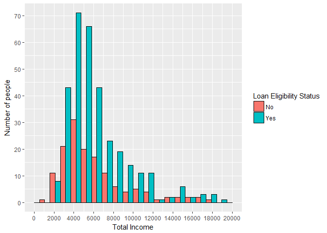
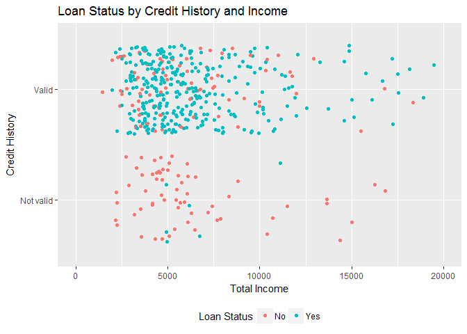
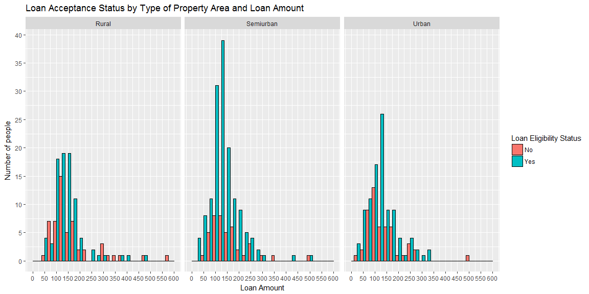
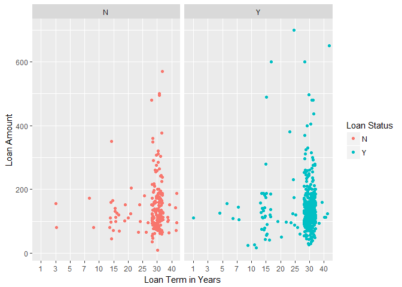
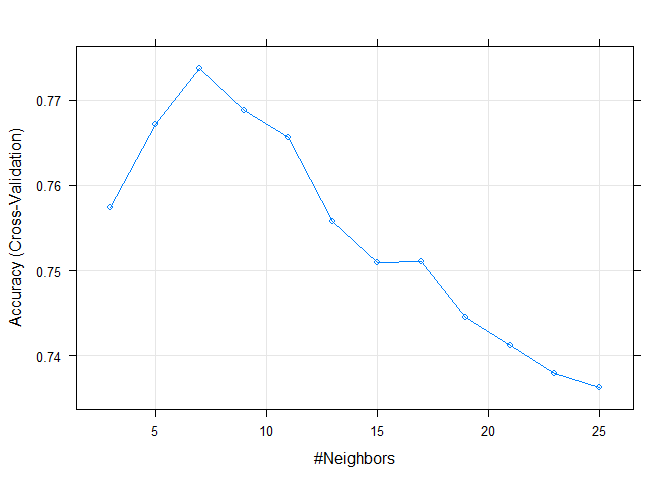

# Loan Prediction


**Author - Nihit R. Save** <br />
**Date - 13th February 2017** <br />

**Dataset:** <https://datahack.analyticsvidhya.com/contest/practice-problem-loan-prediction-iii/> 


## Problem Statement

### About the Company
Dream Housing Finance company deals in all home loans. They have presence across all urban, semi urban and rural areas. Customer first apply for home loan after that company validates the customer eligibility for loan.

### Problem
Company wants to automate the loan eligibility process (real time) based on customer detail provided while filling online application form. These details are Gender, Marital Status, Education, Number of Dependents, Income, Loan Amount, Credit History and others. To automate this process, they have given a problem to identify the customers segments, those are eligible for loan amount so that they can specifically target these customers. 

The train and test data, which can be found at the link given above, contain the following variables:

Variable | Description
| ------------- |:-------------:|
Loan_ID | Unique Loan ID
Gender | Male/ Female
Married | Applicant married (Y/N)
Dependents | Number of dependents
Education | Applicant Education (Graduate/ Under Graduate)
Self_Employed | Self employed (Y/N)
ApplicantIncome | Applicant income
CoapplicantIncome | Coapplicant income
LoanAmount | Loan amount in thousands
Loan_Amount_Term | Term of loan in months
Credit_History | credit history meets guidelines
Property_Area | Urban/ Semi Urban/ Rural
Loan_Status | Loan approved (Y/N)


Data Exploration
================

Loading Dataset from work directory.

``` r
train <- read.csv("train.csv",na.strings = c("","NA"))
test <- read.csv("test.csv",na.strings = c("","NA"))
```

Exploring data and data types in train dataset.

``` r
str(train)
```

    ## 'data.frame':    614 obs. of  13 variables:
    ##  $ Loan_ID          : Factor w/ 614 levels "LP001002","LP001003",..: 1 2 3 4 5 6 7 8 9 10 ...
    ##  $ Gender           : Factor w/ 2 levels "Female","Male": 2 2 2 2 2 2 2 2 2 2 ...
    ##  $ Married          : Factor w/ 2 levels "No","Yes": 1 2 2 2 1 2 2 2 2 2 ...
    ##  $ Dependents       : Factor w/ 4 levels "0","1","2","3+": 1 2 1 1 1 3 1 4 3 2 ...
    ##  $ Education        : Factor w/ 2 levels "Graduate","Not Graduate": 1 1 1 2 1 1 2 1 1 1 ...
    ##  $ Self_Employed    : Factor w/ 2 levels "No","Yes": 1 1 2 1 1 2 1 1 1 1 ...
    ##  $ ApplicantIncome  : int  5849 4583 3000 2583 6000 5417 2333 3036 4006 12841 ...
    ##  $ CoapplicantIncome: num  0 1508 0 2358 0 ...
    ##  $ LoanAmount       : int  NA 128 66 120 141 267 95 158 168 349 ...
    ##  $ Loan_Amount_Term : int  360 360 360 360 360 360 360 360 360 360 ...
    ##  $ Credit_History   : int  1 1 1 1 1 1 1 0 1 1 ...
    ##  $ Property_Area    : Factor w/ 3 levels "Rural","Semiurban",..: 3 1 3 3 3 3 3 2 3 2 ...
    ##  $ Loan_Status      : Factor w/ 2 levels "N","Y": 2 1 2 2 2 2 2 1 2 1 ...

Checking for missing values

``` r
table(is.na(train))
```

    ## 
    ## FALSE  TRUE 
    ##  7833   149

There are 149 missing values in the train data set. <br /> Lets see which variables have missing values.

``` r
colSums(is.na(train))
```

    ##           Loan_ID            Gender           Married        Dependents 
    ##                 0                13                 3                15 
    ##         Education     Self_Employed   ApplicantIncome CoapplicantIncome 
    ##                 0                32                 0                 0 
    ##        LoanAmount  Loan_Amount_Term    Credit_History     Property_Area 
    ##                22                14                50                 0 
    ##       Loan_Status 
    ##                 0

Missing values in categorical variables like Gender and Married cannot be predicted accurately and would require treatment in later stages.

Observing the distribution of variables in dataset.

``` r
summary(train)
```

    ##      Loan_ID       Gender    Married    Dependents        Education  
    ##  LP001002:  1   Female:112   No  :213   0   :345   Graduate    :480  
    ##  LP001003:  1   Male  :489   Yes :398   1   :102   Not Graduate:134  
    ##  LP001005:  1   NA's  : 13   NA's:  3   2   :101                     
    ##  LP001006:  1                           3+  : 51                     
    ##  LP001008:  1                           NA's: 15                     
    ##  LP001011:  1                                                        
    ##  (Other) :608                                                        
    ##  Self_Employed ApplicantIncome CoapplicantIncome   LoanAmount   
    ##  No  :500      Min.   :  150   Min.   :    0     Min.   :  9.0  
    ##  Yes : 82      1st Qu.: 2878   1st Qu.:    0     1st Qu.:100.0  
    ##  NA's: 32      Median : 3812   Median : 1188     Median :128.0  
    ##                Mean   : 5403   Mean   : 1621     Mean   :146.4  
    ##                3rd Qu.: 5795   3rd Qu.: 2297     3rd Qu.:168.0  
    ##                Max.   :81000   Max.   :41667     Max.   :700.0  
    ##                                                  NA's   :22     
    ##  Loan_Amount_Term Credit_History     Property_Area Loan_Status
    ##  Min.   : 12      Min.   :0.0000   Rural    :179   N:192      
    ##  1st Qu.:360      1st Qu.:1.0000   Semiurban:233   Y:422      
    ##  Median :360      Median :1.0000   Urban    :202              
    ##  Mean   :342      Mean   :0.8422                              
    ##  3rd Qu.:360      3rd Qu.:1.0000                              
    ##  Max.   :480      Max.   :1.0000                              
    ##  NA's   :14       NA's   :50

Important Observations: Presence of Outlier in Applicant Income field with maximum value being 81000 and 3rd quantile is only 5795. <br /> Similarly there are outliers present in Coapplicant Income.Maximum value is 41667 while 3rd quantile is 2297.

We notice that Credit History has only 2 levels. Therefore we shall set it as factor.

``` r
train$Credit_History <- factor(train$Credit_History)
```

Data Exploration using Graphs
=============================

Total Income and Loan Status

``` r
  library(ggplot2)


ggplot(na.omit(train),aes(x = ApplicantIncome + CoapplicantIncome)) + geom_histogram(col = "black",position = "dodge",bins = 20,aes(fill = Loan_Status))+scale_x_continuous(breaks = seq(0,20000,2000),limits = c(0,20000)) + scale_y_continuous(breaks = seq(0,90,10)) +xlab("Total Income") + ylab("Number of people") + scale_fill_discrete(name="Loan Acceptance Status",labels = c("No","Yes"))
```



Conclusion: The proportion of people whose loan is accepted increases with the total salary.Thus we can say that total income of applicants play important role in whether the loan is accepted or not.

Total Income,credit history and Status

``` r
ggplot(na.omit(train) , aes(x = ApplicantIncome + CoapplicantIncome,y = Credit_History,col = Loan_Status )) + geom_jitter() + scale_x_continuous(limits = c(0,20000)) + scale_color_discrete(name="Loan Status",labels = c("No","Yes")) + xlab("Total Income") + ylab("Credit History") + ggtitle("Loan Status by Credit History and Income") + scale_y_discrete(labels = c("Not valid","Valid")) + theme(legend.position = "bottom")
```



Conclusion: Thus we can clearly see that the people who do not have valid credit history have very low chance of their loan being accepted inspite of their total income.

Property Area

``` r
ggplot(na.omit(train),aes(x = LoanAmount,fill = Loan_Status)) + geom_bar(stat = "count",binwidth = 25,position = "dodge",col = "black") + facet_wrap(~Property_Area) + scale_x_continuous(limits = c(0,600),breaks = seq(0,600,50)) + scale_y_continuous(breaks = seq(0,50,5)) + ylab("Number of people") + xlab("Loan Amount") + scale_fill_discrete(name="Loan Acceptance Status",labels = c("No","Yes")) + ggtitle("Loan Acceptance Status by Type of Property Area and Loan Amount ")
```



Conclusion: The proportion of people who get their loan accepted for semiurban or urban property is far more than for rural property for the respective loan amount.It could be due to the fact that rural property cost less than semiurban or urban property and less loan is expected to be taken by customers.

Imputation of missing values
============================

To impute missing values we shall use MICE packages. <br /> MICE stands for Multiple Imputation using Chained Equations. <br /> This method tries to predict the values of missing fields based on other variables.

``` r
library(mice)
md.pattern(train)
```

    ##     Loan_ID Education ApplicantIncome CoapplicantIncome Property_Area
    ## 480       1         1               1                 1             1
    ##  12       1         1               1                 1             1
    ##  10       1         1               1                 1             1
    ##  25       1         1               1                 1             1
    ##  19       1         1               1                 1             1
    ##  12       1         1               1                 1             1
    ##  43       1         1               1                 1             1
    ##   2       1         1               1                 1             1
    ##   1       1         1               1                 1             1
    ##   1       1         1               1                 1             1
    ##   1       1         1               1                 1             1
    ##   1       1         1               1                 1             1
    ##   5       1         1               1                 1             1
    ##   1       1         1               1                 1             1
    ##   1       1         1               1                 1             1
    ##           0         0               0                 0             0
    ##     Loan_Status Married Gender Loan_Amount_Term Dependents LoanAmount
    ## 480           1       1      1                1          1          1
    ##  12           1       1      0                1          1          1
    ##  10           1       1      1                1          0          1
    ##  25           1       1      1                1          1          1
    ##  19           1       1      1                1          1          0
    ##  12           1       1      1                0          1          1
    ##  43           1       1      1                1          1          1
    ##   2           1       0      1                1          0          1
    ##   1           1       1      1                1          0          0
    ##   1           1       1      1                0          0          1
    ##   1           1       1      1                0          1          1
    ##   1           1       1      0                1          1          1
    ##   5           1       1      1                1          1          1
    ##   1           1       0      1                1          0          0
    ##   1           1       1      1                1          1          0
    ##               0       3     13               14         15         22
    ##     Self_Employed Credit_History    
    ## 480             1              1   0
    ##  12             1              1   1
    ##  10             1              1   1
    ##  25             0              1   1
    ##  19             1              1   1
    ##  12             1              1   1
    ##  43             1              0   1
    ##   2             1              1   2
    ##   1             1              1   2
    ##   1             1              1   2
    ##   1             0              1   2
    ##   1             1              0   2
    ##   5             0              0   2
    ##   1             1              1   3
    ##   1             0              0   3
    ##                32             50 149

The pattern of missing values can be seen from this table. <br /> For example the 8th row tells us that there are 2 rows in training set that have NAs in both Married and Dependents.

``` r
  MiceImpTrain <- mice(train,m = 3,maxit = 5,MaxNWts = 3000,seed = 123)
```

    iter imp variable
      1   1  Gender  Married  Dependents  Self_Employed  LoanAmount  Loan_Amount_Term  Credit_History
      1   2  Gender  Married  Dependents  Self_Employed  LoanAmount  Loan_Amount_Term  Credit_History
      1   3  Gender  Married  Dependents  Self_Employed  LoanAmount  Loan_Amount_Term  Credit_History
      2   1  Gender  Married  Dependents  Self_Employed  LoanAmount  Loan_Amount_Term  Credit_History
      2   2  Gender  Married  Dependents  Self_Employed  LoanAmount  Loan_Amount_Term  Credit_History
      2   3  Gender  Married  Dependents  Self_Employed  LoanAmount  Loan_Amount_Term  Credit_History
      3   1  Gender  Married  Dependents  Self_Employed  LoanAmount  Loan_Amount_Term  Credit_History
      3   2  Gender  Married  Dependents  Self_Employed  LoanAmount  Loan_Amount_Term  Credit_History
      3   3  Gender  Married  Dependents  Self_Employed  LoanAmount  Loan_Amount_Term  Credit_History
      4   1  Gender  Married  Dependents  Self_Employed  LoanAmount  Loan_Amount_Term  Credit_History
      4   2  Gender  Married  Dependents  Self_Employed  LoanAmount  Loan_Amount_Term  Credit_History
      4   3  Gender  Married  Dependents  Self_Employed  LoanAmount  Loan_Amount_Term  Credit_History
      5   1  Gender  Married  Dependents  Self_Employed  LoanAmount  Loan_Amount_Term  Credit_History
      5   2  Gender  Married  Dependents  Self_Employed  LoanAmount  Loan_Amount_Term  Credit_History
      5   3  Gender  Married  Dependents  Self_Employed  LoanAmount  Loan_Amount_Term  Credit_History

We have set number of multiple of imputations to 3 which is the number of complete datasets created by MICE. <br /> Number of iterations is set to 5 which is the number of times the NAs are evaluated per dataset.

``` r
MiceImpTrain$method
```

              Loan_ID            Gender           Married        Dependents         Education     Self_Employed 
                   ""          "logreg"          "logreg"         "polyreg"                ""          "logreg" 
      ApplicantIncome CoapplicantIncome        LoanAmount  Loan_Amount_Term    Credit_History     Property_Area 
                   ""                ""             "pmm"             "pmm"          "logreg"                "" 
          Loan_Status 
                   "" 

This table tells us the methods used to predict missing values in respective field. <br /> For Gender,Married,Self Employed and Credit History Logistic Regression is used because they have 2 levels each. <br /> For Dependents since there are multiple levels polytomous logistic regression is used. <br /> On the other hand,since Loan Amount and Loan Term are continuous variables predictive mean matching is used.

``` r
MiceImpTrain$imp
```

    $Loan_ID
    NULL

    $Gender
             1      2      3
    24    Male   Male   Male
    127   Male Female   Male
    172 Female   Male   Male
    189   Male Female   Male
    315   Male   Male   Male
    335   Male Female   Male
    461   Male Female   Male
    468   Male   Male   Male
    478   Male   Male   Male
    508 Female   Male   Male
    577   Male   Male   Male
    589   Male Female Female
    593   Male Female Female

    $Married
      1   2  3
    105  No  No No
    229 Yes Yes No
    436 Yes Yes No

    $Dependents
         1  2 3
    103  0  0 1
    105  0  0 0
    121 3+  1 1
    227  0  1 1
    229  2  1 0
    294  0  0 0
    302 3+  1 2
    333  0  0 0
    336 3+  1 0
    347 3+  1 1
    356  0  0 0
    436  1 3+ 0
    518  2  1 1
    572  1  0 1
    598  2  0 0

    $Education
    NULL

    $Self_Employed
          1   2   3
    12   No  No Yes
    20   No  No Yes
    25   No Yes Yes
    30   No Yes Yes
    31  Yes Yes Yes
    96  Yes  No  No
    108  No  No Yes
    112 Yes Yes Yes
    115  No  No Yes
    159  No  No Yes
    171  No  No Yes
    219  No Yes Yes
    232 Yes  No Yes
    237 Yes Yes Yes
    269 Yes Yes Yes
    296  No  No Yes
    334 Yes Yes Yes
    337  No  No Yes
    345  No Yes Yes
    375 Yes Yes Yes
    381 Yes  No Yes
    386 Yes  No  No
    412 Yes  No Yes
    433  No Yes Yes
    448  No  No Yes
    464  No Yes Yes
    469  No Yes Yes
    536  No  No Yes
    543 Yes Yes Yes
    580 Yes  No Yes
    601 Yes Yes Yes
    602  No  No Yes

    $ApplicantIncome
    NULL

    $CoapplicantIncome
    NULL

    $LoanAmount
          1   2   3
    1   106  46  88
    36  148  66 113
    64   90 128 102
    82  121  66 148
    96   76 105  88
    103 137  66 128
    104 137  66 134
    114  61  26 121
    128  99  45  88
    203 168 170  98
    285 122 128 114
    306 108 105  87
    323 130 115 132
    339  81 139  60
    388 122 128  88
    436  93  86  98
    438 143  66 113
    480 144 175 132
    525 100 105 108
    551  90 175 107
    552 133  66 128
    606 155 109  99

    $Loan_Amount_Term
          1   2   3
    20  360 360 360
    37  300 360 240
    45  360 360 360
    46  360 300 300
    74   60 480 300
    113 240 360 240
    166 360 480 360
    198 360 300 300
    224 360 480 360
    233 360 360 360
    336 180 360 360
    368 180 360 240
    422 240 240 120
    424 240 360 240

    $Credit_History
        1 2 3
    17  1 1 1
    25  0 1 1
    31  0 1 0
    43  1 1 1
    80  1 1 1
    84  0 0 0
    87  1 1 1
    96  1 0 0
    118 1 1 1
    126 1 1 1
    130 0 0 0
    131 1 0 0
    157 1 1 1
    182 0 0 1
    188 1 1 1
    199 0 0 1
    220 0 0 1
    237 0 0 0
    238 0 1 0
    260 0 0 0
    261 0 1 1
    280 0 1 1
    310 1 1 1
    314 1 1 1
    318 1 1 1
    319 0 1 1
    324 0 0 1
    349 1 0 0
    364 1 1 0
    378 1 1 1
    393 0 1 1
    396 1 1 1
    412 1 1 0
    445 0 1 0
    450 1 1 0
    452 1 1 1
    461 1 1 0
    474 0 1 1
    491 1 1 1
    492 0 1 1
    498 1 1 1
    504 0 1 1
    507 0 0 0
    531 0 1 0
    534 1 1 1
    545 0 1 1
    557 0 1 1
    566 1 1 0
    584 0 1 1
    601 0 0 0

    $Property_Area
    NULL

    $Loan_Status
    NULL

We shall fill the dataset using complete function.

``` r
MicedTrain <- complete(MiceImpTrain,action = 3)
```

Similarly we shall fill in the missing values in test data set using MICE.

``` r
MiceImpTest <- mice(data = test, m = 3, maxit = 5, seed = 123, MaxNWts = 3000)
```

    iter imp variable
      1   1  Gender  Dependents  Self_Employed  LoanAmount  Loan_Amount_Term  Credit_History
      1   2  Gender  Dependents  Self_Employed  LoanAmount  Loan_Amount_Term  Credit_History
      1   3  Gender  Dependents  Self_Employed  LoanAmount  Loan_Amount_Term  Credit_History
      2   1  Gender  Dependents  Self_Employed  LoanAmount  Loan_Amount_Term  Credit_History
      2   2  Gender  Dependents  Self_Employed  LoanAmount  Loan_Amount_Term  Credit_History
      2   3  Gender  Dependents  Self_Employed  LoanAmount  Loan_Amount_Term  Credit_History
      3   1  Gender  Dependents  Self_Employed  LoanAmount  Loan_Amount_Term  Credit_History
      3   2  Gender  Dependents  Self_Employed  LoanAmount  Loan_Amount_Term  Credit_History
      3   3  Gender  Dependents  Self_Employed  LoanAmount  Loan_Amount_Term  Credit_History
      4   1  Gender  Dependents  Self_Employed  LoanAmount  Loan_Amount_Term  Credit_History
      4   2  Gender  Dependents  Self_Employed  LoanAmount  Loan_Amount_Term  Credit_History
      4   3  Gender  Dependents  Self_Employed  LoanAmount  Loan_Amount_Term  Credit_History
      5   1  Gender  Dependents  Self_Employed  LoanAmount  Loan_Amount_Term  Credit_History
      5   2  Gender  Dependents  Self_Employed  LoanAmount  Loan_Amount_Term  Credit_History
      5   3  Gender  Dependents  Self_Employed  LoanAmount  Loan_Amount_Term  Credit_History

``` r
MicedTest <- complete(MiceImpTest,action = 1)
```

### Combining Datasets

``` r
dim(train)
```

    ## [1] 614  13

``` r
dim(test)
```

    ## [1] 367  12

Test dataset has 1 less column which is that of value to predicted. <br /> Adding Loan Status column in test dataset.

``` r
MicedTest$Loan_Status <- NA
```

Combining both the datasets for further data manipulation.

``` r
combined <- rbind(MicedTrain,MicedTest)
```

### Feature Engineering New Variables: Ratio and Loan Term Year

Individuals who have more income might be able to take more loan. <br /> Therefore we shall create a new variable called Ratio and set it equal to Total Income divided by Loan Amount.

``` r
combined$Total_Income <- combined$ApplicantIncome + combined$CoapplicantIncome
combined$Ratio <- combined$Total_Income/combined$LoanAmount
```

``` r
table(combined$Loan_Amount_Term)
```

    ## 
    ##  12  36  60  84 120 180 240 300 360 480 
    ##   3   3   3   7   5  66  14  23 834  23

We notice that Loan Term takes only few distinct values which are the number of months. <br /> Hence we shall represent it in number of years and set it as factor. Also we shall set Credit History as factor.

``` r
combined$Loan_Term_Year <- factor(combined$Loan_Amount_Term/12)
combined$Credit_History <- factor(combined$Credit_History)
```

Lets explore how loan amount and loan term are related. Loan Amount and Term

``` r
 ggplot(na.omit(combined),aes(x = Loan_Term_Year,y= LoanAmount,col = Loan_Status)) + geom_jitter() + scale_color_discrete(name = "Loan Status") + facet_wrap(~Loan_Status) + xlab("Loan Term in Years") + ylab("Loan Amount")
```

 Conclusion: Most of the people have taken loan for 30 years. <br /> Loan term is not a major deciding factor in deciding loan status.

### Outlier Treatment

Earlier we noticed that there were some outliers in our dataset. <br /> We shall normalize the distribution of Total Income and Loan Amount by using logarithmic function and store it as new variable.

``` r
combined$Total_Income_Log <- log(combined$Total_Income)
```

``` r
combined$Loan_Amount_Log <- log(combined$LoanAmount)
```

### Splitting the dataset

``` r
new_train <- combined[(1:nrow(train)),]
new_test <- combined[-(1:nrow(train)),]
```

Using Logistic Regression Model
===============================

Initially we create a base model without adding any new variables as a basis for evaluating our further models.

``` r
 BaseModel <- glm(Loan_Status ~ Gender + Married + Dependents + Education + Self_Employed + ApplicantIncome + CoapplicantIncome + LoanAmount + Loan_Term_Year + Credit_History + Property_Area,data = new_train, family = "binomial")

summary(BaseModel)
```

    ## 
    ## Call:
    ## glm(formula = Loan_Status ~ Gender + Married + Dependents + Education + 
    ##     Self_Employed + ApplicantIncome + CoapplicantIncome + LoanAmount + 
    ##     Loan_Term_Year + Credit_History + Property_Area, family = "binomial", 
    ##     data = new_train)
    ## 
    ## Deviance Residuals: 
    ##     Min       1Q   Median       3Q      Max  
    ## -2.2383  -0.5134   0.5319   0.6983   2.4703  
    ## 
    ## Coefficients:
    ##                          Estimate Std. Error z value Pr(>|z|)    
    ## (Intercept)             1.164e+01  1.455e+03   0.008  0.99362    
    ## GenderMale             -9.796e-04  2.989e-01  -0.003  0.99738    
    ## MarriedYes              5.679e-01  2.606e-01   2.179  0.02932 *  
    ## Dependents1            -5.854e-01  2.959e-01  -1.979  0.04783 *  
    ## Dependents2             9.065e-03  3.316e-01   0.027  0.97819    
    ## Dependents3+           -2.207e-01  4.151e-01  -0.532  0.59494    
    ## EducationNot Graduate  -3.800e-01  2.587e-01  -1.469  0.14182    
    ## Self_EmployedYes        1.268e-01  2.831e-01   0.448  0.65425    
    ## ApplicantIncome        -7.409e-06  2.455e-05  -0.302  0.76279    
    ## CoapplicantIncome      -4.976e-05  4.052e-05  -1.228  0.21946    
    ## LoanAmount              3.322e-04  1.711e-03   0.194  0.84605    
    ## Loan_Term_Year3        -3.089e+01  1.782e+03  -0.017  0.98617    
    ## Loan_Term_Year5         5.213e-01  1.780e+03   0.000  0.99977    
    ## Loan_Term_Year7        -1.426e+01  1.455e+03  -0.010  0.99218    
    ## Loan_Term_Year10       -1.305e+01  1.455e+03  -0.009  0.99284    
    ## Loan_Term_Year15       -1.368e+01  1.455e+03  -0.009  0.99250    
    ## Loan_Term_Year20       -1.452e+01  1.455e+03  -0.010  0.99204    
    ## Loan_Term_Year25       -1.351e+01  1.455e+03  -0.009  0.99260    
    ## Loan_Term_Year30       -1.393e+01  1.455e+03  -0.010  0.99236    
    ## Loan_Term_Year40       -1.516e+01  1.455e+03  -0.010  0.99169    
    ## Credit_History1         3.171e+00  3.054e-01  10.383  < 2e-16 ***
    ## Property_AreaSemiurban  9.807e-01  2.685e-01   3.652  0.00026 ***
    ## Property_AreaUrban      3.298e-01  2.633e-01   1.253  0.21039    
    ## ---
    ## Signif. codes:  0 '***' 0.001 '**' 0.01 '*' 0.05 '.' 0.1 ' ' 1
    ## 
    ## (Dispersion parameter for binomial family taken to be 1)
    ## 
    ##     Null deviance: 762.89  on 613  degrees of freedom
    ## Residual deviance: 562.96  on 591  degrees of freedom
    ## AIC: 608.96
    ## 
    ## Number of Fisher Scoring iterations: 14

From above summary we can see that Number of Dependants,Marriage Status,Credit History and Property Area are major deciding factors to predict loan status. <br /> To judge if our subsequent models perform better than our base model we will use Accuracy and AIC which penalizes models for adding irrelevant variables.

Lets check the accuracy of our base model before we move on to the next. <br /> The ce() function from Metrics library allows us to compute classification error.

``` r
library(Metrics)
selfpredict <- predict(BaseModel,type = "response")
Loan_Status <- ifelse(selfpredict > 0.5,"Y","N")

ce(new_train$Loan_Status,Loan_Status)
```

    ## [1] 0.1856678

We can see that about 19% of values were misclassified giving us accuracy of 81%.

``` r
Model2 <- glm(Loan_Status ~ Gender + Married + Dependents + Education + Self_Employed + ApplicantIncome + CoapplicantIncome + Ratio + Loan_Term_Year + Credit_History + Property_Area,data = new_train, family = "binomial")


summary(Model2)
```

    ## 
    ## Call:
    ## glm(formula = Loan_Status ~ Gender + Married + Dependents + Education + 
    ##     Self_Employed + ApplicantIncome + CoapplicantIncome + Ratio + 
    ##     Loan_Term_Year + Credit_History + Property_Area, family = "binomial", 
    ##     data = new_train)
    ## 
    ## Deviance Residuals: 
    ##     Min       1Q   Median       3Q      Max  
    ## -2.2382  -0.5155   0.5324   0.6994   2.5090  
    ## 
    ## Coefficients:
    ##                          Estimate Std. Error z value Pr(>|z|)    
    ## (Intercept)             1.168e+01  1.455e+03   0.008  0.99360    
    ## GenderMale             -3.184e-03  2.994e-01  -0.011  0.99152    
    ## MarriedYes              5.688e-01  2.604e-01   2.184  0.02895 *  
    ## Dependents1            -5.813e-01  2.957e-01  -1.966  0.04930 *  
    ## Dependents2             1.060e-02  3.315e-01   0.032  0.97449    
    ## Dependents3+           -2.180e-01  4.143e-01  -0.526  0.59880    
    ## EducationNot Graduate  -3.845e-01  2.574e-01  -1.494  0.13517    
    ## Self_EmployedYes        1.281e-01  2.831e-01   0.453  0.65088    
    ## ApplicantIncome        -2.782e-06  2.215e-05  -0.126  0.90003    
    ## CoapplicantIncome      -4.402e-05  4.410e-05  -0.998  0.31823    
    ## Ratio                  -5.906e-04  3.339e-03  -0.177  0.85959    
    ## Loan_Term_Year3        -3.089e+01  1.782e+03  -0.017  0.98617    
    ## Loan_Term_Year5         5.233e-01  1.781e+03   0.000  0.99977    
    ## Loan_Term_Year7        -1.426e+01  1.455e+03  -0.010  0.99218    
    ## Loan_Term_Year10       -1.303e+01  1.455e+03  -0.009  0.99286    
    ## Loan_Term_Year15       -1.368e+01  1.455e+03  -0.009  0.99250    
    ## Loan_Term_Year20       -1.452e+01  1.455e+03  -0.010  0.99204    
    ## Loan_Term_Year25       -1.350e+01  1.455e+03  -0.009  0.99260    
    ## Loan_Term_Year30       -1.392e+01  1.455e+03  -0.010  0.99237    
    ## Loan_Term_Year40       -1.516e+01  1.455e+03  -0.010  0.99169    
    ## Credit_History1         3.172e+00  3.061e-01  10.362  < 2e-16 ***
    ## Property_AreaSemiurban  9.811e-01  2.686e-01   3.652  0.00026 ***
    ## Property_AreaUrban      3.299e-01  2.636e-01   1.251  0.21079    
    ## ---
    ## Signif. codes:  0 '***' 0.001 '**' 0.01 '*' 0.05 '.' 0.1 ' ' 1
    ## 
    ## (Dispersion parameter for binomial family taken to be 1)
    ## 
    ##     Null deviance: 762.89  on 613  degrees of freedom
    ## Residual deviance: 562.97  on 591  degrees of freedom
    ## AIC: 608.97
    ## 
    ## Number of Fisher Scoring iterations: 14

``` r
selfpredict <- predict(Model2,type = "response")
Loan_Status <- ifelse(selfpredict > 0.5,"Y","N")

ce(new_train$Loan_Status,Loan_Status)
```

    ## [1] 0.1856678

There wasn't any significant change in AIC as well as accuracy when we added the Ratio variable and also the p-value associated with Ratio is much greater than 0.05. <br /> Thus we can conclude that Ratio is an insignificant variable. <br />

Lets try using log transformed variables.

``` r
Model3 <- glm(Loan_Status ~ Gender + Married + Dependents + Education + Self_Employed + ApplicantIncome + CoapplicantIncome + Total_Income_Log + Loan_Amount_Log + Loan_Term_Year + Credit_History + Property_Area,data = new_train, family = "binomial")

summary(Model3)
```

    ## 
    ## Call:
    ## glm(formula = Loan_Status ~ Gender + Married + Dependents + Education + 
    ##     Self_Employed + ApplicantIncome + CoapplicantIncome + Total_Income_Log + 
    ##     Loan_Amount_Log + Loan_Term_Year + Credit_History + Property_Area, 
    ##     family = "binomial", data = new_train)
    ## 
    ## Deviance Residuals: 
    ##     Min       1Q   Median       3Q      Max  
    ## -2.2907  -0.5100   0.5210   0.6931   2.4694  
    ## 
    ## Coefficients:
    ##                          Estimate Std. Error z value Pr(>|z|)    
    ## (Intercept)             7.742e+00  1.455e+03   0.005 0.995756    
    ## GenderMale             -3.455e-02  3.013e-01  -0.115 0.908705    
    ## MarriedYes              5.608e-01  2.614e-01   2.145 0.031927 *  
    ## Dependents1            -6.033e-01  2.965e-01  -2.034 0.041920 *  
    ## Dependents2             2.010e-03  3.328e-01   0.006 0.995181    
    ## Dependents3+           -2.021e-01  4.170e-01  -0.485 0.627892    
    ## EducationNot Graduate  -3.481e-01  2.599e-01  -1.340 0.180381    
    ## Self_EmployedYes        9.773e-02  2.854e-01   0.342 0.732015    
    ## ApplicantIncome        -3.898e-05  3.664e-05  -1.064 0.287373    
    ## CoapplicantIncome      -9.217e-05  5.691e-05  -1.620 0.105324    
    ## Total_Income_Log        5.109e-01  4.751e-01   1.075 0.282245    
    ## Loan_Amount_Log        -7.196e-02  3.034e-01  -0.237 0.812528    
    ## Loan_Term_Year3        -3.066e+01  1.782e+03  -0.017 0.986268    
    ## Loan_Term_Year5         5.240e-01  1.780e+03   0.000 0.999765    
    ## Loan_Term_Year7        -1.411e+01  1.455e+03  -0.010 0.992265    
    ## Loan_Term_Year10       -1.287e+01  1.455e+03  -0.009 0.992944    
    ## Loan_Term_Year15       -1.356e+01  1.455e+03  -0.009 0.992566    
    ## Loan_Term_Year20       -1.442e+01  1.455e+03  -0.010 0.992094    
    ## Loan_Term_Year25       -1.334e+01  1.455e+03  -0.009 0.992686    
    ## Loan_Term_Year30       -1.380e+01  1.455e+03  -0.009 0.992434    
    ## Loan_Term_Year40       -1.498e+01  1.455e+03  -0.010 0.991790    
    ## Credit_History1         3.165e+00  3.062e-01  10.334  < 2e-16 ***
    ## Property_AreaSemiurban  9.939e-01  2.696e-01   3.686 0.000227 ***
    ## Property_AreaUrban      3.586e-01  2.661e-01   1.347 0.177851    
    ## ---
    ## Signif. codes:  0 '***' 0.001 '**' 0.01 '*' 0.05 '.' 0.1 ' ' 1
    ## 
    ## (Dispersion parameter for binomial family taken to be 1)
    ## 
    ##     Null deviance: 762.89  on 613  degrees of freedom
    ## Residual deviance: 561.75  on 590  degrees of freedom
    ## AIC: 609.75
    ## 
    ## Number of Fisher Scoring iterations: 14

``` r
selfpredict <- predict(Model3,type = "response")
Loan_Status <- ifelse(selfpredict > 0.5,"Y","N")

ce(new_train$Loan_Status,Loan_Status)
```

    ## [1] 0.1856678

The accuracy remained same while AIC increased than our previous model when we used the log transformed variables hence they seem insignificant.<br />

Lets make a model using only the most important variables. <br /> We will select variables which have p-value less than 0.05.

``` r
Model4 <- glm(Loan_Status ~ Married + Dependents + Credit_History + Property_Area ,data = new_train, family = "binomial")

summary(Model4)
```

    ## 
    ## Call:
    ## glm(formula = Loan_Status ~ Married + Dependents + Credit_History + 
    ##     Property_Area, family = "binomial", data = new_train)
    ## 
    ## Deviance Residuals: 
    ##     Min       1Q   Median       3Q      Max  
    ## -2.1682  -0.5400   0.5791   0.6921   2.2594  
    ## 
    ## Coefficients:
    ##                        Estimate Std. Error z value Pr(>|z|)    
    ## (Intercept)            -2.47136    0.35741  -6.915 4.69e-12 ***
    ## MarriedYes              0.63269    0.23513   2.691 0.007129 ** 
    ## Dependents1            -0.61937    0.28493  -2.174 0.029724 *  
    ## Dependents2            -0.01312    0.32793  -0.040 0.968096    
    ## Dependents3+           -0.18040    0.39753  -0.454 0.649975    
    ## Credit_History1         3.15886    0.29783  10.606  < 2e-16 ***
    ## Property_AreaSemiurban  0.93019    0.26081   3.567 0.000362 ***
    ## Property_AreaUrban      0.38046    0.25448   1.495 0.134903    
    ## ---
    ## Signif. codes:  0 '***' 0.001 '**' 0.01 '*' 0.05 '.' 0.1 ' ' 1
    ## 
    ## (Dispersion parameter for binomial family taken to be 1)
    ## 
    ##     Null deviance: 762.89  on 613  degrees of freedom
    ## Residual deviance: 578.96  on 606  degrees of freedom
    ## AIC: 594.96
    ## 
    ## Number of Fisher Scoring iterations: 4

``` r
selfpredict <- predict(Model4,type = "response")
Loan_Status <- ifelse(selfpredict > 0.5,"Y","N")

ce(new_train$Loan_Status,Loan_Status)
```

    ## [1] 0.1938111

Even though the accuracy has decreased slightly, we can see the AIC has decreased significantly and we shall use this model to predict for our test data . <br />

The most important variables are:-<br /> 1\] Credit History <br /> 2\] Property Area <br /> 3\] Marital Status <br /> 4\] Dependents <br />

### Predicting the loan status for test dataset using Logistic Regression Model

The predict function returns the probability instead of actual levels. <br /> Therefore we shall store it as a variable in test set and use it to determine the loan status.

``` r
new_test$prediction <- predict(Model4,newdata = new_test,type = "response")
    
new_test$Loan_Status <- ifelse(new_test$prediction > 0.5,"Y","N")
```

### Writing Prediction to csv file and submitting the solution

``` r
MyPredicition <- new_test[,c(1,13)]
  
write.csv(MyPredicition,"MyPrediction.csv",row.names = FALSE,quote = FALSE)
```

On submitting the prediction, we found out that 78% of our values we predicted for loan status were correct.
<br />

Lets try a model using K-Nearest Neighbor algorithm.

Using K Nearest Neighbor Model
==============================

We shall assign train set to different variable for KNN model in case we need to revert back to original train set.

``` r
library(plyr)
library(dplyr)

knn_train <- new_train %>% select(Gender,Married,Dependents,Education,Self_Employed,ApplicantIncome,CoapplicantIncome,Total_Income,Loan_Term_Year,LoanAmount,Credit_History,Property_Area,Loan_Status)
```

We shall use the caret (Classification and Regression Training) library to train our KNN model. For resampling we will use 10 fold cross validation. This is set by trainControl() method. <br />

KNN requires its continuous variables to be normalized and therefore we will set preProcess parameter to "center" and "scale". <br />

We can use various values of K (Number of Nearest Neighbors) by setting tuneGrid parameter and thus it is set to sequence from 3 to 25 in steps of 2. <br /> Optimal value of K for model will be selected based on accuracy

``` r
library(caret)

set.seed(999)
trctrl <- trainControl(method = "cv", number = 10)

knn_fit <- train(Loan_Status ~., data = knn_train, method = "knn",
                   trControl=trctrl,
                  preProcess = c("center", "scale"),tuneGrid = data.frame(.k = seq(3,25,2))) 

knn_fit
```

    ## k-Nearest Neighbors 
    ## 
    ## 614 samples
    ##  12 predictor
    ##   2 classes: 'N', 'Y' 
    ## 
    ## Pre-processing: centered (23), scaled (23) 
    ## Resampling: Cross-Validated (10 fold) 
    ## Summary of sample sizes: 553, 552, 553, 551, 553, 552, ... 
    ## Resampling results across tuning parameters:
    ## 
    ##   k   Accuracy   Kappa    
    ##    3  0.7574140  0.3826761
    ##    5  0.7671980  0.3862107
    ##    7  0.7736761  0.3941477
    ##    9  0.7688365  0.3725090
    ##   11  0.7655834  0.3546121
    ##   13  0.7557218  0.3192502
    ##   15  0.7509359  0.2964415
    ##   17  0.7510400  0.2925684
    ##   19  0.7444562  0.2641606
    ##   21  0.7412039  0.2531912
    ##   23  0.7379253  0.2389417
    ##   25  0.7363388  0.2282902
    ## 
    ## Accuracy was used to select the optimal model using  the largest value.
    ## The final value used for the model was k = 7.

Model accuracy is highest (77%) when K = 7. But inspite that it is less than Logistic Regression model. <br /> 
Nonetheless it is close enough to the accuracy of glm model and hence shall see how our KNN model performs on test dataset. <br />

Accuracy for different values of K can be visualized in the graph below.

``` r
plot(knn_fit)
```



### Predicting the Loan Status for Test dataset using K Nearest Neighbor Model

``` r
new_testknn <- new_test %>% select(Gender,Married,Dependents,Education,Self_Employed,ApplicantIncome,CoapplicantIncome,Total_Income,Loan_Term_Year,LoanAmount,Credit_History,Property_Area,Loan_Status)

predictknn <- predict(knn_fit,newdata = new_testknn)
MyPredicition <- cbind(new_test["Loan_ID"],predictknn)
 
names(MyPredicition)[2] <- "Loan_Status"
write.csv(MyPredicition,"MyCaretKNN.csv",row.names = FALSE,quote = FALSE)
```

On submitting the prediction, we found out that 75% of values predicted by KNN on the test dataset were correct compared to 77% of logistic regression model. <br /> <br /> <br />
